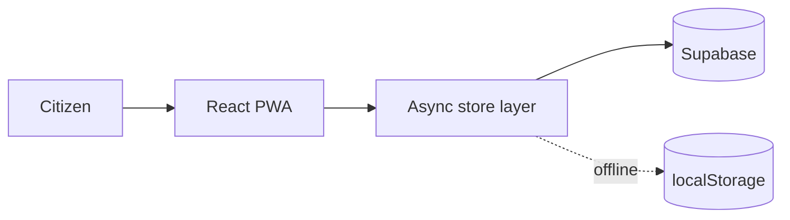

# PROJECT NAME

One sentence. What it does, for whom.

Smart India Hackathon · Problem Statement #XXXX · Team NAME

---
layout: statement
---

# THE NUMBER

The single statistic that makes the problem undeniable. Cite the source.

---

# The problem

- Who is hurt, concretely. Name the person, not the category.
- What they do today, and why it fails.
- What it costs — time, money, or lives.

::right::

> Judges reward understanding the problem over cleverness in the solution.
> Spend a real slide here.

---
layout: two-cols
---

# Our solution

One sentence a non-technical judge repeats correctly afterwards.

Then three bullets, no more:

- The core mechanism
- The thing nobody else does
- Why it works offline / at scale / in a village

::right::

DEMO

---
layout: center
class: text-center
---

# Live demo

Recording as backup. Never demo live without one.

---

# How it works

The store layer is one file. Swapping localStorage for Supabase changes nothing else.

---

# Why this scales

| Concern | Our answer |
| --- | --- |
| 1M users | Single data interface, swap backend, zero component changes |
| No connectivity | PWA with service worker; works fully offline |
| Low-end devices | No UI framework bloat, 6 dependencies total |
| Adoption | Works in the browser. Nothing to install. |

---
layout: statement
---

# Impact

If this ships, who is measurably better off, and by how much?

---
layout: end
---

# Thank you

github.com/USERNAME/REPO
